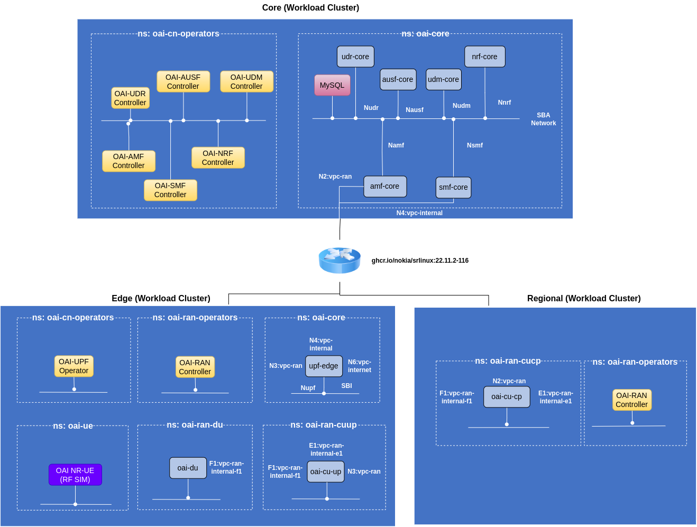
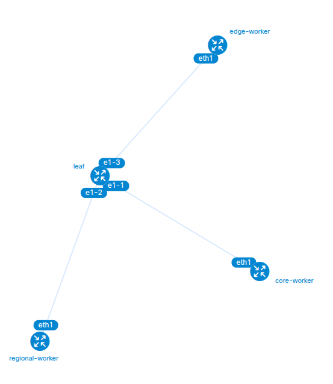

# Table of Contents

* [Using Kubenet for Transport in Nephio](#using-kubenet-for-transport-in-nephio)
   * [Prerequisites](#prerequisites)
   * [Configuration](#configuration)
   * [Usage](#usage)
      * [Create infrastructure](#create-infrastructure)
      * [Status](#status)
      * [Network planning](#network-planning)
         * [Discover networking devices](#discover-networking-devices)
         * [Inventory and topology](#inventory-and-topology)
         * [Declare a list of VLANs](#declare-a-list-of-vlans)
         * [Dynamic VLAN allocation](#dynamic-vlan-allocation)
         * [IP Prefix Declaration](#ip-prefix-declaration)
         * [Dynamic IP Subnet Allocation](#dynamic-ip-subnet-allocation)
         * [Create Interfaces for different VLANs inside the Kind clusters](#create-interfaces-for-different-vlans-inside-the-kind-clusters)
         * [Creating Network Instances/VPC IRB](#creating-network-instancesvpc-irb)
         * [Testing the networking](#testing-the-networking)
      * [Destroy infrastructure](#destroy-infrastructure)
   * [Integrating Kubenet with Nephio](#integrating-kubenet-with-nephio)
      * [Creating infrastructure](#creating-infrastructure)
      * [Designing packages](#designing-packages)

# Using Kubenet for Transport in Nephio

To really understand kubenet you should follow this readme --> https://learn.kubenet.dev/

Then to know why this readme is written you should read about this nephio issue --> https://github.com/nephio-project/nephio/issues/933

Currently Nephio uses its networking libraries built during Nephio R1, but those libraries are not maintained. Instead of using those libraries I did a small PoC to see if we can replace the networking layer with Kubenet and it seems we can put we need to make changes in Nephio controllers. Later in the readme I will highlight which changes we need to make. 

I created a script to make a playground to combine Kubenet and Nephio project together and see what can be done. 

The (script)[./infra-manager.py] automates the creation, management, and tear down of a multi-cluster Kind-based Kubernetes testbed with networking features such as VLANs, IPAM, and network custom resources. The cluster topology is similar to Nephio R3/4/5 OAI experimentation. One leaf and workload three clusters (Core, Regional, Edge) and one management cluster.



It integrates:

1. Single docker network for cluster connectivity, we can have different networks for each cluster but that will increases the complexity. 
2. Kind clusters (management, core, regional, edge)
3. Multus CNI for workload clusters
4. Containerlab topology deployment
5. Network CRD orchestration (VLAN, IP claims)

I made small changes in terms of VPC and VLANs which are used in Nephio R3/4/5, I created additional VPCs and VLANs

VPC/Network-instances

1. N2
2. N3
3. N4
4. N6
5. SBI
6. F1
7. E1
8. Default (this is needed today for the kuidapp to function, I have opened an issue to know the design reason for this --> https://github.com/kubenet-dev/kubenet/issues/17)

For each of this network instance we need a dedicated VLAN and IP Subnet, which is chosen from declared global prefixes. 

## Prerequisites

1. Ensure the following dependencies are installed on your system:
  - Docker: 28.3.3
  - python3: 3.10.13 (you can user higher I think)
  - Kind: v0.29.0 go1.24.2 linux/amd64
  - Kubectl: v1.29.3 (client)/ server 1.33.2
  - Containerlab: 0.69.3
  - PyYAML: pip install pyyaml
  - curl, tar, iproute2 

## Configuration

Edit the following sections in the script as needed:

1. Networks (NETWORKS): Defines Docker bridge networks for each cluster (mgmt, core, regional, edge). I kept it simple and used only one subnet for all clusters. 
2. Cluster YAMLs (CLUSTERS_YAML): Points to Kind cluster configuration files. Only if you change the name of the files. 
3. Topology Settings: if you change the name or connection
  - TOPOLOGY_NAME="5g": Topology name used in VLAN/IP claims
  - ENDPOINT_BASE:  Endpoint mappings for each cluster type

## Usage

Run the script with one of the following commands:

python infra-manager.py {create|destroy|status|gen-crs|apply-crs|network-plan} [step]

Follow all this in order

### Create infrastructure

```bash
python infra-manager.py create
```

This will set sysctl limits (needs root access/sudo password), creates docker networks, creates kind clusters (mgmt, core, regional, edge). Installs Multus & CNI plugins. Deploys Containerlab topology. Installs Kubenet components, KUID server and apps, sdc, pkgserver. 

**NOTE**: Pkgserver is not really needed for Nephio deployment but right now kuidapps depends on the pkgserver and they communicate. If we decided to go forward with kubenet in Nephio then we can remove this dependency from kuidapp.

The output is similar to:

```bash
[INFO] Waiting for pods in cluster mgmt to be healthy (timeout 300s)...
[INFO] Cluster mgmt has pending pods: kuid-system/kuid-nokia-srl-545dff65fd-m5twv (Pending), kuid-system/kuid-server-756c754c48-fvrhj (Pending), kuid-system/kuidapps-5cbb8bcccc-9wsst (Pending), local-path-storage/helper-pod-create-pvc-70898cfb-55f0-4c6f-9b33-a28cadd47187 (Pending), local-path-storage/helper-pod-create-pvc-b2020540-415d-4efa-a3db-49f85f68af75 (Pending), ...
[INFO] Cluster mgmt has pending pods: kuid-system/kuid-server-756c754c48-fvrhj (Pending), kuid-system/kuidapps-5cbb8bcccc-9wsst (Pending), local-path-storage/helper-pod-create-pvc-e27eea54-7e85-4632-8e4c-fcdfe1cb769a (Succeeded), network-system/config-server-745b669744-xqn92 (Pending)
[INFO] Cluster mgmt has pending pods: kuid-system/kuid-server-756c754c48-fvrhj (Pending), network-system/config-server-745b669744-xqn92 (Pending)
[INFO] Cluster mgmt has pending pods: network-system/config-server-745b669744-xqn92 (Pending)
[OK] All pods in mgmt are healthy ✅
[OK] Infra created ✅
```



### Status

Check if the clusters are running

```bash
python infra-manager.py status
```

Output is similar to:

```
./infra-manager.py status
[INFO] Current clusters:
core
edge
mgmt
regional
[INFO] Current docker networks:
  kind (172.21.76.0/24)
  kind (172.21.76.0/24)
  kind (172.21.76.0/24)
  kind (172.21.76.0/24)
```

### Network planning 

There are multiple steps in network planning as described examples --> https://learn.kubenet.dev/02-examples/01_about/ 

You can follow each and every step of network planning because these are the steps we need to declare a network instance for nephio as well. If you want all the below steps to be done quickly then just use the below command and go to the last step to test the connectivity for a network instance: 

```bash
python infra-manager.py network-plan
```

#### Discover networking devices 

Here we will discover the srlinux device configured in the containerlab topology. 

```bash
python infra-manager.py network-plan discovery
```

Output is similar to:

```
[INFO] Creating device definition:
schema.inv.sdcio.dev/srl.nokia.sdcio.dev-24.3.2 created
secret/srl.nokia.sdcio.dev created
targetconnectionprofile.inv.sdcio.dev/conn-gnmi-skipverify created
targetsyncprofile.inv.sdcio.dev/sync-gnmi-get created
discoveryrule.inv.sdcio.dev/dr-dynamic created
[INFO] Waiting for all targets.inv.sdcio.dev to become Ready (timeout 300s)...
[INFO] No targets.inv.sdcio.dev found yet...
[INFO] No targets.inv.sdcio.dev found yet...
[INFO] No targets.inv.sdcio.dev found yet...
[INFO] No targets.inv.sdcio.dev found yet...
[INFO] Still waiting: leaf (pending: Ready (missing))
[OK] all targets.inv.sdcio.dev is Ready ✅
[OK] Network plan step 'discovery' completed ✅
```

To check the target device you need use the resource `targets.inv.sdcio.dev`

```bash
kubectl get targets.inv.sdcio.dev
```

Uutput is similar to:

```
NAME   READY   REASON   PROVIDER              ADDRESS             PLATFORM      SERIALNUMBER     MACADDRESS
leaf   True             srl.nokia.sdcio.dev   172.21.76.9:57400   7220 IXR-D3   Sim Serial No.   1A:C4:02:FF:00:00
```

#### Inventory and topology 

Each network device has different numbers of Ethernet ports and design so at this step we upload the device inventory and the container lab topology 

```bash
python infra-manager.py network-plan inventory
```

Output is similar to:

```
[INFO] Creating device inventory and registering CLAB topology:
nodemodel.srl.nokia.app.kuid.dev/ixr-d3.srlinux.nokia.com created
topology.topo.app.kuid.dev/5g created
[INFO] Waiting for all nodes.infra.be.kuid.dev to become Ready (timeout 300s)...
[INFO] Still waiting: 5g.region1.site1.leaf (pending: Ready (missing))
[OK] all nodes.infra.be.kuid.dev is Ready ✅
[OK] Network plan step 'inventory' completed ✅
```

```
kubectl get nodemodels.srl.nokia.app.kuid.dev 
NAME                       AGE
ixr-d3.srlinux.nokia.com   118s
```

```
kubectl get topologies.topo.app.kuid.dev 
NAME   READY
5g     True
```

#### Declare a list of VLANs 

We need to define a VLAN pool from where we can select VLANs for different network instances: 

```bash
python infra-manager.py network-plan vlan-indices
```

Output is similar to:

```
[INFO] Creating VLAN Indices:
vlanindex.vlan.be.kuid.dev/5g created
[INFO] Waiting for all vlanindices.vlan.be.kuid.dev to become Ready (timeout 300s)...
[OK] all vlanindices.vlan.be.kuid.dev is Ready ✅
[OK] Network plan step 'vlan-indices' completed ✅
```

```
kubectl get vlanindices.vlan.be.kuid.dev
NAME   READY   MINID   MAXID
5g     True    2       9
```

There are are vlans from 2 to 9, now we can randomly pick vlans for different networks

#### Dynamic VLAN allocation

```bash
python infra-manager.py network-plan dynamic-vlan
```

Output is similar to:

```
[INFO] Requesting VLANs for different networks:
vlanclaim.vlan.be.kuid.dev/f1 created
vlanclaim.vlan.be.kuid.dev/e1 created
vlanclaim.vlan.be.kuid.dev/n2 created
vlanclaim.vlan.be.kuid.dev/n3 created
vlanclaim.vlan.be.kuid.dev/n4 created
vlanclaim.vlan.be.kuid.dev/n6 created
vlanclaim.vlan.be.kuid.dev/sbi created
vlanclaim.vlan.be.kuid.dev/default created
[INFO] Waiting for all vlanclaims.vlan.be.kuid.dev to become Ready (timeout 300s)...
[INFO] Still waiting: default (pending: Ready (missing)), n2 (pending: Ready (missing)), n3 (pending: Ready (missing)), n4 (pending: Ready (missing)), n6 (pending: Ready (missing)), ...
[OK] all vlanclaims.vlan.be.kuid.dev is Ready ✅
[OK] Network plan step 'dynamic-vlan' completed ✅
```

```
kubectl get vlanclaims.vlan.be.kuid.dev
NAME      READY   INDEX   CLAIMTYPE   CLAIMREQ   CLAIMRSP
default   True    5g      dynamicID              7
e1        True    5g      dynamicID              3
f1        True    5g      dynamicID              2
n2        True    5g      dynamicID              8
n3        True    5g      dynamicID              9
n4        True    5g      dynamicID              4
n6        True    5g      dynamicID              5
sbi       True    5g      dynamicID              6
```

So each network instance have a dedicated VLAN, now we can declare global ip-prefix and then create dedicated ip-subnets for each network instance

#### IP Prefix Declaration

```bash
python infra-manager.py network-plan ip-indices
```

Output is similar to:

```
[INFO] Creating IP prefixes:
ipindex.ipam.be.kuid.dev/5g.default created
ipindex.ipam.be.kuid.dev/5g.f1 created
ipindex.ipam.be.kuid.dev/5g.e1 created
ipindex.ipam.be.kuid.dev/5g.sbi created
ipindex.ipam.be.kuid.dev/5g.n6 created
ipindex.ipam.be.kuid.dev/5g.n2 created
ipindex.ipam.be.kuid.dev/5g.n3 created
ipindex.ipam.be.kuid.dev/5g.n4 created
[INFO] Waiting for all ipindices.ipam.be.kuid.dev to become Ready (timeout 300s)...
[OK] all ipindices.ipam.be.kuid.dev is Ready ✅
[OK] Network plan step 'ip-indices' completed ✅
```

```
 kubectl get ipindices.ipam.be.kuid.dev 
NAME         READY   PREFIX0         PREFIX1   PREFIX2   PREFIX3   PREFIX4
5g.default   True    172.10.0.0/16                                 
5g.e1        True    172.4.0.0/16                                  
5g.f1        True    172.5.0.0/16                                  
5g.n2        True    172.2.0.0/16                                  
5g.n3        True    172.3.0.0/16                                  
5g.n4        True    172.6.0.0/16                                  
5g.n6        True    172.0.0.0/16                                  
5g.sbi       True    172.1.0.0/16                       
```

Now we can dynamically claim the ip-subnets for each network instance

#### Dynamic IP Subnet Allocation 

```bash
python infra-manager.py network-plan networks
```

Output is similar to:

```
[INFO] Creating different networks:
networkconfig.network.app.kuid.dev/5g.default created
networkconfig.network.app.kuid.dev/5g.f1 created
networkconfig.network.app.kuid.dev/5g.e1 created
networkconfig.network.app.kuid.dev/5g.sbi created
networkconfig.network.app.kuid.dev/5g.n3 created
networkconfig.network.app.kuid.dev/5g.n6 created
networkconfig.network.app.kuid.dev/5g.n2 created
networkconfig.network.app.kuid.dev/5g.n4 created
[INFO] Waiting for all ipclaims.ipam.be.kuid.dev to become Ready (timeout 300s)...
[INFO] Still waiting: 5g.e1.172.4.1.0-24 (pending: Ready (missing)), 5g.e1.172.4.2.0-24 (pending: Ready (missing)), 5g.f1.172.5.1.0-24 (pending: Ready (missing)), 5g.f1.172.5.2.0-24 (pending: Ready (missing)), 5g.sbi.172.1.1.0-24 (pending: Ready (missing)), ...
[OK] all ipclaims.ipam.be.kuid.dev is Ready ✅
[OK] Network plan step 'networks' completed ✅
```

```
kubectl get networkconfigs.network.app.kuid.dev 
NAME         READY
5g.default   True
5g.e1        True
5g.f1        True
5g.n2        True
5g.n3        True
5g.n4        True
5g.n6        True
5g.sbi       True
```

```
kubectl get ipclaims.ipam.be.kuid.dev 
NAME                       READY   INDEX        CLAIMTYPE      PREFIXTYPE   CLAIMREQ        CLAIMRSP        DEFAULTGATEWAY
5g.default.172.10.1.0-24   True    5g.default   staticPrefix   network      172.10.1.0/24   172.10.1.0/24   
5g.default.172.10.2.0-24   True    5g.default   staticPrefix   network      172.10.2.0/24   172.10.2.0/24   
5g.default.172.10.3.0-24   True    5g.default   staticPrefix   network      172.10.3.0/24   172.10.3.0/24   
5g.e1.172.4.1.0-24         True    5g.e1        staticPrefix   network      172.4.1.0/24    172.4.1.0/24    
5g.e1.172.4.2.0-24         True    5g.e1        staticPrefix   network      172.4.2.0/24    172.4.2.0/24    
5g.f1.172.5.1.0-24         True    5g.f1        staticPrefix   network      172.5.1.0/24    172.5.1.0/24    
5g.f1.172.5.2.0-24         True    5g.f1        staticPrefix   network      172.5.2.0/24    172.5.2.0/24    
5g.n2.172.2.1.0-24         True    5g.n2        staticPrefix   network      172.2.1.0/24    172.2.1.0/24    
5g.n2.172.2.2.0-24         True    5g.n2        staticPrefix   network      172.2.2.0/24    172.2.2.0/24    
5g.n3.172.3.1.0-24         True    5g.n3        staticPrefix   network      172.3.1.0/24    172.3.1.0/24    
5g.n4.172.6.1.0-24         True    5g.n4        staticPrefix   network      172.6.1.0/24    172.6.1.0/24    
5g.n4.172.6.2.0-24         True    5g.n4        staticPrefix   network      172.6.2.0/24    172.6.2.0/24    
5g.n6.172.0.1.0-24         True    5g.n6        staticPrefix   network      172.0.1.0/24    172.0.1.0/24    
5g.sbi.172.1.1.0-24        True    5g.sbi       staticPrefix   network      172.1.1.0/24    172.1.1.0/24    
5g.sbi.172.1.2.0-24        True    5g.sbi       staticPrefix   network      172.1.2.0/24    172.1.2.0/24
```

When we create an IRB the ip-addresses for the default gateway are not automatically claimed or selected so we need to manually request (make a claim) for ip-addresses of the default gateway

```bash
python infra-manager.py network-plan ipclaims
```

expected output:

```
[INFO] Creating IP Claims for the VPCs:
ipclaim.ipam.be.kuid.dev/5g.default-core-rt created
ipclaim.ipam.be.kuid.dev/5g.default-edge-rt created
ipclaim.ipam.be.kuid.dev/5g.default-regional-rt created
ipclaim.ipam.be.kuid.dev/5g.n2-core-rt created
ipclaim.ipam.be.kuid.dev/5g.n2-regional-rt created
ipclaim.ipam.be.kuid.dev/5g.n3-edge-rt created
ipclaim.ipam.be.kuid.dev/5g.n4-edge-rt created
ipclaim.ipam.be.kuid.dev/5g.n4-core-rt created
ipclaim.ipam.be.kuid.dev/5g.n6-edge-rt created
ipclaim.ipam.be.kuid.dev/5g.sbi-core-rt created
ipclaim.ipam.be.kuid.dev/5g.sbi-edge-rt created
ipclaim.ipam.be.kuid.dev/5g.f1-regional-rt created
ipclaim.ipam.be.kuid.dev/5g.f1-edge-rt created
ipclaim.ipam.be.kuid.dev/5g.e1-regional-rt created
ipclaim.ipam.be.kuid.dev/5g.e1-edge-rt created
[INFO] Waiting for all ipclaims.ipam.be.kuid.dev to become Ready (timeout 300s)...
[INFO] Still waiting: 5g.e1-edge-rt (pending: Ready (missing)), 5g.e1-regional-rt (pending: Ready (missing)), 5g.f1-edge-rt (pending: Ready (missing)), 5g.f1-regional-rt (pending: Ready (missing)), 5g.n2-core-rt (pending: Ready (missing)), ...
[INFO] Still waiting: 5g.e1-edge-rt (pending: Ready (missing))
[OK] all ipclaims.ipam.be.kuid.dev is Ready ✅
[OK] Network plan step 'ipclaims' completed ✅
```

#### Create Interfaces for different VLANs inside the Kind clusters

Each network uses a tagged VLAN interface on the kind clusters so each cluster need different tagged interfaces for different networks. 


```bash
python infra-manager.py network-plan vlan-interfaces
```

Expected output:

```
[INFO] Creating VLANs on the worker nodes:
[INFO] Creating VLAN interfaces for VLAN IDs 2–9
Device "eth1.2" does not exist.
[OK] core-worker: created eth1.2
Device "eth1.3" does not exist.
[OK] core-worker: created eth1.3
Device "eth1.4" does not exist.
[OK] core-worker: created eth1.4
Device "eth1.5" does not exist.
[OK] core-worker: created eth1.5
Device "eth1.6" does not exist.
[OK] core-worker: created eth1.6
Device "eth1.7" does not exist.
[OK] core-worker: created eth1.7
Device "eth1.8" does not exist.
[OK] core-worker: created eth1.8
Device "eth1.9" does not exist.
[OK] core-worker: created eth1.9
Device "eth1.2" does not exist.
[OK] regional-worker: created eth1.2
Device "eth1.3" does not exist.
[OK] regional-worker: created eth1.3
Device "eth1.4" does not exist.
[OK] regional-worker: created eth1.4
Device "eth1.5" does not exist.
[OK] regional-worker: created eth1.5
Device "eth1.6" does not exist.
[OK] regional-worker: created eth1.6
Device "eth1.7" does not exist.
[OK] regional-worker: created eth1.7
Device "eth1.8" does not exist.
[OK] regional-worker: created eth1.8
Device "eth1.9" does not exist.
[OK] regional-worker: created eth1.9
Device "eth1.2" does not exist.
[OK] edge-worker: created eth1.2
Device "eth1.3" does not exist.
[OK] edge-worker: created eth1.3
Device "eth1.4" does not exist.
[OK] edge-worker: created eth1.4
Device "eth1.5" does not exist.
[OK] edge-worker: created eth1.5
Device "eth1.6" does not exist.
[OK] edge-worker: created eth1.6
Device "eth1.7" does not exist.
[OK] edge-worker: created eth1.7
Device "eth1.8" does not exist.
[OK] edge-worker: created eth1.8
Device "eth1.9" does not exist.
[OK] edge-worker: created eth1.9
[OK] Network plan step 'vlan-interfaces' completed ✅
```

**NOTE**: Script is creating all the VLANs on all the kind cluster though we don't need all VLANs we just need a subset of VLANs on each cluster. This can be easily fix 

#### Creating Network Instances/VPC IRB

Now we need to generate a `networks.network.app.kuid.dev` resource which contains information for a IRB (Integrated Routing and Bridging)

```bash
./infra-manager.py gen-crs
```

Output is similar to:

```
[INFO] Fetching VLAN and IP claims...
[INFO] Generated 8 VPC Generated → network-crs.yaml
```

I really recommend you to open and understand the generated `network-crs.yaml` file it explains different IRB networks. 

Now you can create the IRBs by applying the file

```bash
python infra-manager.py apply-crs
```

Expected output:

```
network.network.app.kuid.dev/5g.vpc-default created
network.network.app.kuid.dev/5g.vpc-e1 created
network.network.app.kuid.dev/5g.vpc-f1 created
network.network.app.kuid.dev/5g.vpc-n2 created
network.network.app.kuid.dev/5g.vpc-n3 created
network.network.app.kuid.dev/5g.vpc-n4 created
network.network.app.kuid.dev/5g.vpc-n6 created
network.network.app.kuid.dev/5g.vpc-sbi created
[OK] Applied network-crs.yaml
[INFO] Waiting for all configs.config.sdcio.dev to become Ready (timeout 300s)...
[INFO] No configs.config.sdcio.dev found yet...
[INFO] Still waiting: 5g.vpc-f1.leaf (pending: Ready (missing))
[INFO] Still waiting: 5g.vpc-default.leaf (pending: Ready (missing)), 5g.vpc-n2.leaf (pending: Ready (missing)), 5g.vpc-n3.leaf (pending: Ready (missing))
[OK] all configs.config.sdcio.dev is Ready ✅

```

Different IRBs

```bash
kubectl get configs.config.sdcio.dev 
NAME                  READY   REASON   TARGET         SCHEMA
5g.vpc-default.leaf   True    ready    default/leaf   srl.nokia.sdcio.dev/24.3.2
5g.vpc-e1.leaf        True    ready    default/leaf   srl.nokia.sdcio.dev/24.3.2
5g.vpc-f1.leaf        True    ready    default/leaf   srl.nokia.sdcio.dev/24.3.2
5g.vpc-n2.leaf        True    ready    default/leaf   srl.nokia.sdcio.dev/24.3.2
5g.vpc-n3.leaf        True    ready    default/leaf   srl.nokia.sdcio.dev/24.3.2
5g.vpc-n4.leaf        True    ready    default/leaf   srl.nokia.sdcio.dev/24.3.2
5g.vpc-n6.leaf        True    ready    default/leaf   srl.nokia.sdcio.dev/24.3.2
5g.vpc-sbi.leaf       True    ready    default/leaf   srl.nokia.sdcio.dev/24.3.2
```

You can also access to the switch and check 

```
docker exec -it net-5g-leaf sr_cli -- show network-instance summary
+------------------------------------------+----------------------+----------------------+----------------------+------------------------------------------+----------------------------------------------------+
|                   Name                   |         Type         |     Admin state      |      Oper state      |                Router id                 |                    Description                     |
+==========================================+======================+======================+======================+==========================================+====================================================+
| mgmt                                     | ip-vrf               | enable               | up                   |                                          | Management network instance                        |
| vpc-default.core-bd                      | mac-vrf              | enable               | up                   | N/A                                      | k8s-vpc-default.core-bd                            |
| vpc-default.default-rt                   | ip-vrf               | enable               | up                   |                                          | k8s-vpc-default.default-rt                         |
| vpc-default.edge-bd                      | mac-vrf              | enable               | up                   | N/A                                      | k8s-vpc-default.edge-bd                            |
| vpc-default.regional-bd                  | mac-vrf              | enable               | up                   | N/A                                      | k8s-vpc-default.regional-bd                        |
| vpc-e1.e1-rt                             | ip-vrf               | enable               | up                   |                                          | k8s-vpc-e1.e1-rt                                   |
| vpc-e1.edge-bd                           | mac-vrf              | enable               | up                   | N/A                                      | k8s-vpc-e1.edge-bd                                 |
| vpc-e1.regional-bd                       | mac-vrf              | enable               | up                   | N/A                                      | k8s-vpc-e1.regional-bd                             |
| vpc-f1.edge-bd                           | mac-vrf              | enable               | up                   | N/A                                      | k8s-vpc-f1.edge-bd                                 |
| vpc-f1.f1-rt                             | ip-vrf               | enable               | up                   |                                          | k8s-vpc-f1.f1-rt                                   |
| vpc-f1.regional-bd                       | mac-vrf              | enable               | up                   | N/A                                      | k8s-vpc-f1.regional-bd                             |
| vpc-n2.core-bd                           | mac-vrf              | enable               | up                   | N/A                                      | k8s-vpc-n2.core-bd                                 |
| vpc-n2.n2-rt                             | ip-vrf               | enable               | up                   |                                          | k8s-vpc-n2.n2-rt                                   |
| vpc-n2.regional-bd                       | mac-vrf              | enable               | up                   | N/A                                      | k8s-vpc-n2.regional-bd                             |
| vpc-n3.edge-bd                           | mac-vrf              | enable               | up                   | N/A                                      | k8s-vpc-n3.edge-bd                                 |
| vpc-n3.n3-rt                             | ip-vrf               | enable               | up                   |                                          | k8s-vpc-n3.n3-rt                                   |
| vpc-n4.core-bd                           | mac-vrf              | enable               | up                   | N/A                                      | k8s-vpc-n4.core-bd                                 |
| vpc-n4.edge-bd                           | mac-vrf              | enable               | up                   | N/A                                      | k8s-vpc-n4.edge-bd                                 |
| vpc-n4.n4-rt                             | ip-vrf               | enable               | up                   |                                          | k8s-vpc-n4.n4-rt                                   |
| vpc-n6.edge-bd                           | mac-vrf              | enable               | up                   | N/A                                      | k8s-vpc-n6.edge-bd                                 |
| vpc-n6.n6-rt                             | ip-vrf               | enable               | up                   |                                          | k8s-vpc-n6.n6-rt                                   |
| vpc-sbi.core-bd                          | mac-vrf              | enable               | up                   | N/A                                      | k8s-vpc-sbi.core-bd                                |
| vpc-sbi.edge-bd                          | mac-vrf              | enable               | up                   | N/A                                      | k8s-vpc-sbi.edge-bd                                |
| vpc-sbi.sbi-rt                           | ip-vrf               | enable               | up                   |                                          | k8s-vpc-sbi.sbi-rt                                 |
+------------------------------------------+----------------------+----------------------+----------------------+------------------------------------------+----------------------------------------------------+
```

#### Testing the networking

So now we will instantiate two containers on two clusters (edge and regional) to mimic oran o-cu-up (edge) and o-cu-cp (regional) E1 connectivity for this we need to use E1 network  

We will configure the `NetworkAttachmentDefinition` with parent interface, default gateway ip-address, route to reach different cluster, ip-address of the pod. We need below information: 

1. Default gateway of E1 VPC which connects edge cluster and leaf
2. Default gateway of E1 VPC which connects regional cluster and leaf
3. Physical interface for VLAN of E1

```bash
kubectl get ipclaims.ipam.be.kuid.dev -l nephio.org/network-name=e1
```

Expected output two ip-addresses one for edge and other for regional cluster

```
NAME                READY   INDEX   CLAIMTYPE        PREFIXTYPE   CLAIMREQ   CLAIMRSP       DEFAULTGATEWAY
5g.e1-edge-rt       True    5g.e1   dynamicAddress   other                   172.4.2.1/24   
5g.e1-regional-rt   True    5g.e1   dynamicAddress   other                   172.4.1.1/24
```

**NOTE**: The above ip-address claim can change, it is all dynamic. 

Vlan claim and physical interface 

```bash
kubectl get vlanclaims.vlan.be.kuid.dev -l nephio.org/network-name=e1
NAME   READY   INDEX   CLAIMTYPE   CLAIMREQ   CLAIMRSP
e1     True    5g      dynamicID              3
```

**NOTE**: The above vlan claim can change, it is all dynamic. 

Physical interface is defined as `eth1.VLANCLAIM` so in this case `eth1.3` for both clusters

Use these ip-addresses and physical interfaces inside `test-pods/pod-edge.yaml` and `test/pod-regional.yaml` and apply both yamls on respective clusters. 

```bash
kubectl create -f test-pods/pod-edge.yaml --context kind-edge
kubectl create -f test-pods/pod-regional.yaml --context kind-regional
```

You can go inside any of the one containers and try to ping the other 

```bash
kubectl exec -it samplepod --context kind-edge -- ping -c4 172.4.1.2
PING 172.4.1.2 (172.4.1.2) 56(84) bytes of data.
64 bytes from 172.4.1.2: icmp_seq=1 ttl=63 time=0.458 ms
64 bytes from 172.4.1.2: icmp_seq=2 ttl=63 time=0.490 ms
64 bytes from 172.4.1.2: icmp_seq=3 ttl=63 time=0.338 ms
64 bytes from 172.4.1.2: icmp_seq=4 ttl=63 time=0.407 ms

--- 172.4.1.2 ping statistics ---
4 packets transmitted, 4 received, 0% packet loss, time 3080ms
rtt min/avg/max/mdev = 0.338/0.423/0.490/0.059 ms
```

### Destroy infrastructure

```bash
python infra-manager.py destroy
```


## Integrating Kubenet with Nephio 

The creation of the network, claim of IP and VLAN in Nephio is similar to the Kubenet project, but with different CRs, which are similar to the above CRs. The [EPIC](https://github.com/nephio-project/nephio/issues/933) defines the process of creating different CRs, which are needed to attach an additional network interface to pods instantiated via Nephio. 

### Creating infrastructure 

1. **Currently what happens in Nephio?**: 
    - Creation of Nephio management cluster
    - Creation of Workload clusters via PV(s)
    - Define container lab topology and connect all the clusters using leaf switching fabric (done using a shell script)
    - Declare VPCs (networks.infra.nephio.org) via PVs
    - Generate a RawTopology to interconnect clusters, create tagged vlan interfaces for each VLAN on each cluster (done using a shell script)

2. **What will happen if Kubenet is used?**
    - Creation of Nephio management cluster with components from Kubenet 
    - Creation of Workload clusters via PV(s)
    - Define container lab topology and connect all the clusters using leaf switching fabric (done using a shell script)
    - Create physical interfaces for each VLAN on each cluster (can be done on a later stage) (done using a shell script)
    - Discover networking devices (`targets.inv.sdcio.dev`) and declare their inventory via PVs
    - Create IP-Prefix and VlanIndicies, VlanClaims, Networks, IPClaims for default gateway via PVs
    - Create IRB/VPCs via PVs

### Designing packages 

1. **Currently what happens in Nephio?**
    - A workload package like [ran](https://github.com/nephio-project/catalog/tree/main/workloads/oai/pkg-example-cucp-bp) or core generally contains
        - `network.infra.nephio.org` for each VPC
        - `interface.req.nephio.org` for each interface
    - After specialization (ipam-specializer, vlan-specializer) there is:
        - ipclaim.ipam.resource.nephio.org for each interface
        - vlanclaim.ipam.resource.nephio.org for each interface
    - Update the `status` field of `interface.req.nephio.org` and add below information 
      ```
        ipClaimStatus:
        - prefix: 172.4.1.254/24
          gateway: 172.4.1.1
        vlanClaimStatus:
          vlanID: 6
      ```
    - Create `NetworkAttachmentDefinition.k8s.cni.cncf.io` for each interface using the details from `interface.req.nephio.org`

2. **What will happen if Kubenet is used?**
    - A workload package like [ran](https://github.com/nephio-project/catalog/tree/main/workloads/oai/pkg-example-cucp-bp) or core will only contain
        - `interface.req.nephio.org` for each interface, we can add an annotation to request for static-ip-address, specific dns label, ipv4 or ipv6
        - `network.infra.nephio.org` for each VPC (is not really needed, I don't see the utility at the moment)
    - Create new specializers which can: 
        - create `ipclaim.ipam.be.kuid.dev/v1alpha1` for each interface
        - update status field of `interface.req.nephio.org` with above defined information and also dns information
    - Create `NetworkAttachmentDefinition.k8s.cni.cncf.io` for each interface using the details from `interface.req.nephio.org`
